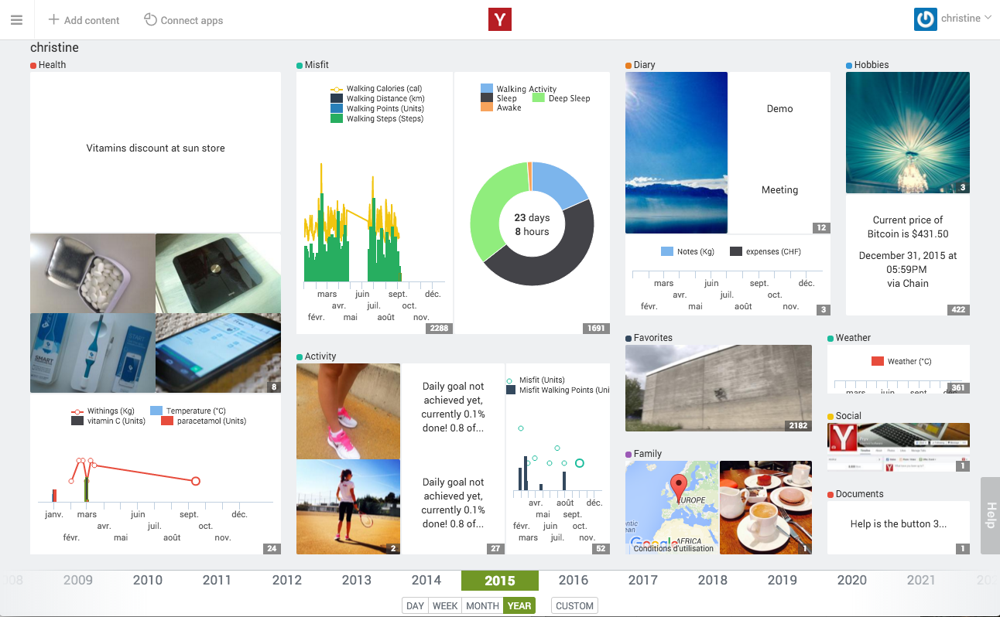

# Pryv for the web a.k.a. ‘the browser’

The Pryv web app, featuring the dashboard view.

## Usage

Normaly exposed on the internet as `https://{username}.{domain}` 

A domain and user agnostic version is published on github gh-pages. It can be accessed with:   
`https://pryv.github.io/app-web/?username={username}&domain={domain}`   
for example:   
`https://pryv.github.io/app-web/?username=christine&domain=pryv.io`

## Contributing

### Setting up the development environment

`scripts/setup-environment-dev.sh`

### Building

- `grunt` for dev
- `grunt production` for production
- `grunt ghpages` for gh-pages

Build output goes to `./dist`

### Running the dev build locally

Requires a working copy of our [dev tools repo](https://github.com/pryv/dev-tools).

1. Start the dev web server, pointing it to your built app (in `./dist`), for example: `node ../dev-tools/web-server/source/server.js --staticRootPath ./dist`
2. Open `https://{username}.rec.la:4443`, where `{username}` points to an existing staging user

`scripts/start-server.sh [username]` will do the above automatically if your dev tools copy is in `../dev-tools`.

## License

[Revised BSD license](https://github.com/pryv/documents/blob/master/license-bsd-revised.md)
